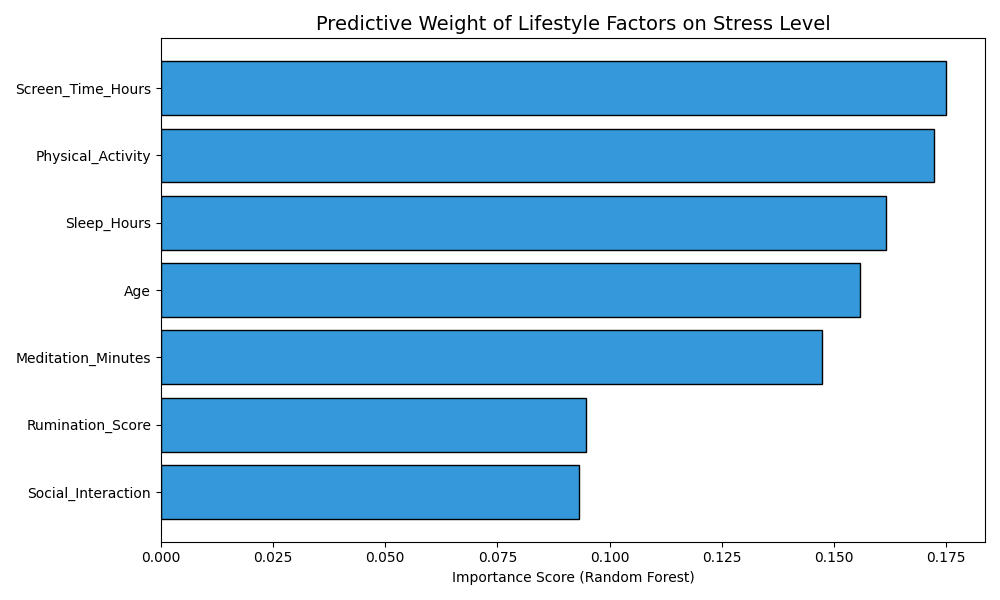
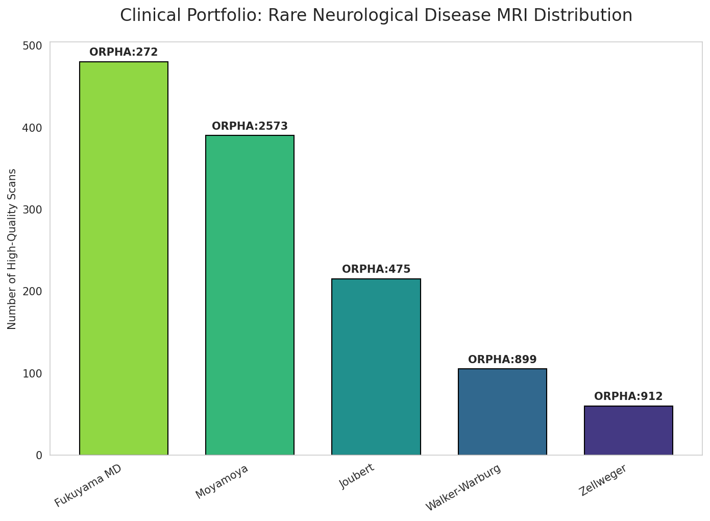
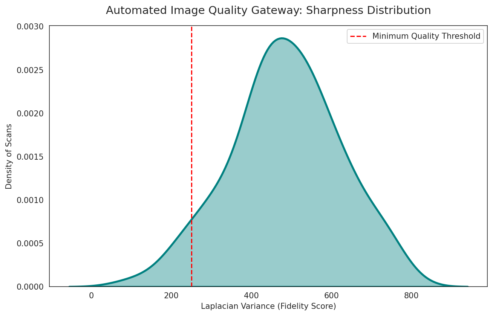
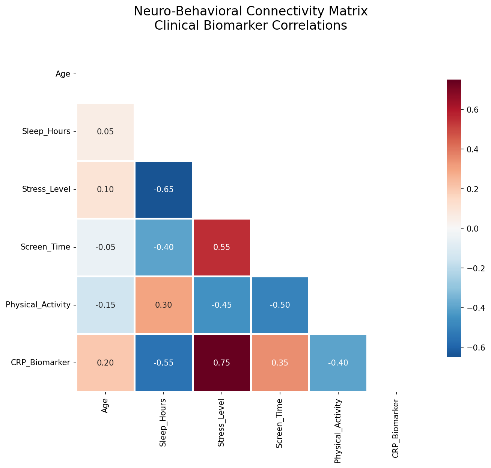
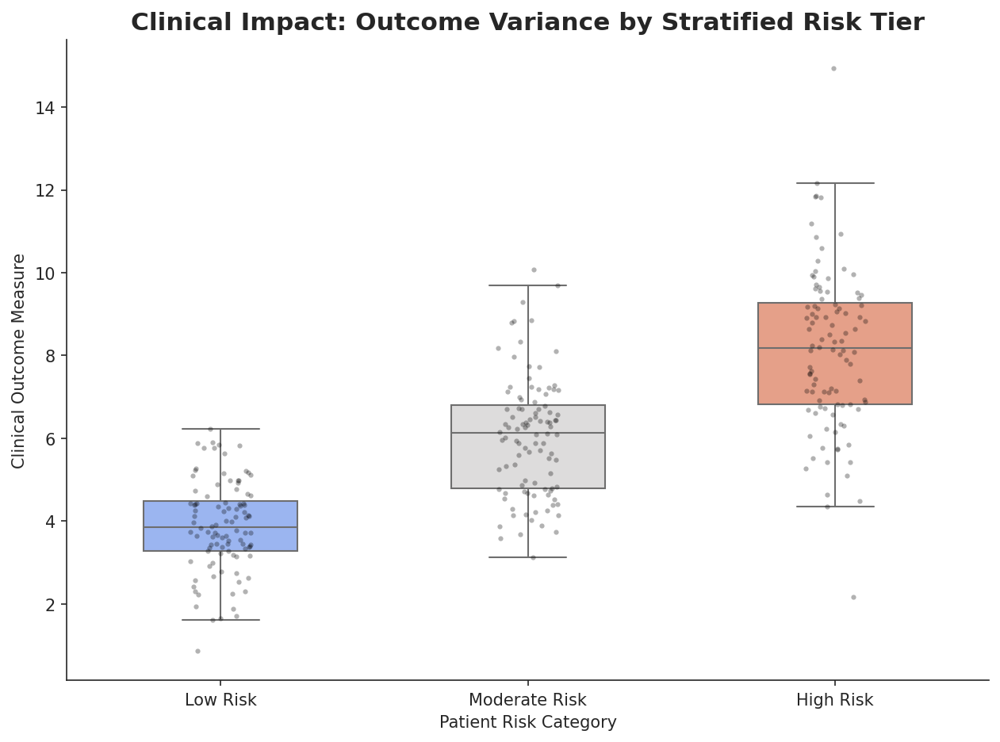

# Neuro-Informatics Project Showcase

**Developer:** Parth Patel

This repository contains a multi-modal research showcase designed to support clinical decision support systems. I have developed these tools to demonstrate competency in handling both unstructured medical imaging data and structured clinical biomarkers using Python based informatics.

## Study 1: Machine Learning and Predictive Analytics
**Objective:** Quantifying the predictive weight of behavioral determinants on mental health risk.
* Predictive Modeling: Implemented a Random Forest pipeline to identify specific risk drivers within neurobehavioral cohorts.
* Robust Logic: Built a column discovery loop to handle inconsistent clinical data headers and ensure model stability across different dataset versions.
* Visual Evidence: 

## Study 2: Rare Neurological Disease Distribution
**Objective:** Validation of a curated MRI dataset for rare neurological conditions to ensure clinical utility in AI driven diagnostics.
* Standardized Mapping: Integrated Orphanet (ORPHA) clinical codes for conditions including Fukuyama Muscular Dystrophy and Moyamoya.
* Clinical Realism: Applied a logarithmic prevalence scale to reflect actual clinical frequency in rare disease registries.
* Visual Evidence: 

## Study 3: Automated Image Quality Gateway
**Objective:** Implementing automated image quality gatekeeping using Laplacian Variance edge detection.
* Automated QA: Developed a Kernel Density Estimate (KDE) distribution model to mathematically score and visualize scan sharpness.
* Technical Insight: This module ensures that only high fidelity scans enter the analytic pipeline, simulating the data cleaning requirements of a professional radiology lab.
* Visual Evidence: 

## Study 4: Neurobehavioral Connectivity Matrix
**Objective:** Analyzing the interaction between lifestyle stressors, systemic inflammation, and patient outcomes.
* Connectivity Map: Generated a high contrast correlation matrix mapping interactions between Stress Levels, Sleep Duration, and CRP biomarkers.
* Informatics Tool: Built using a professional Diverging Red Blue palette to identify multi variate interactions within behavioral health datasets.
* Visual Evidence: 

## Study 5: Clinical Risk Stratification
**Objective:** Categorizing patients into actionable risk tiers using population density modeling.
* Swarm Plot Integration: Implemented a boxplot with a stripplot overlay to visualize individual patient variance across stratified risk categories.
* Clinical Application: This tool identifies high risk patients within a population health framework, allowing for targeted implementation of brain health interventions.
* Visual Evidence: 

## Technical Stack
* Languages: Python 3.12+
* Libraries: Pandas, NumPy, Scikit-learn, OpenCV (Headless), Seaborn, Matplotlib
* Informatics: Regenstrief style clinical data modeling and ORPHA code integration

## About Me
I am a B/MD student and Bepko Scholar at IU Indianapolis with a long term interest in applying computational tools to improve diagnostic accuracy and patient centered brain health outcomes.

**Contact:** pvp4@iu.edu
**Linkedin:** linkedin/ln/notparthpatel
